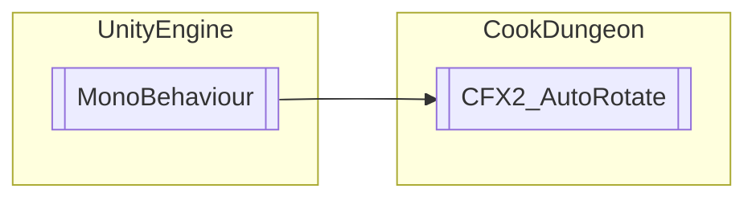

# CFX2_AutoRotate `Public class`

## Diagram


## Details
### Inheritance
 - `MonoBehaviour`

### Constructors
#### CFX2_AutoRotate
```csharp
public CFX2_AutoRotate()
```

*Generated with* [*ModularDoc*](https://github.com/hailstorm75/ModularDoc)
