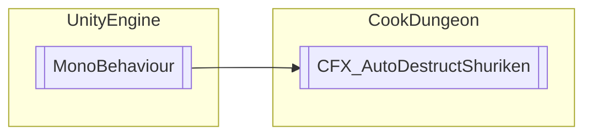

# CFX_AutoDestructShuriken `Public class`

## Diagram


## Members
### Methods
#### Public  methods
| Returns | Name |
| --- | --- |
| `void` | [`MM`](#mm)() |

## Details
### Inheritance
 - `MonoBehaviour`

### Constructors
#### CFX_AutoDestructShuriken
```csharp
public CFX_AutoDestructShuriken()
```

### Methods
#### MM
```csharp
public void MM()
```

*Generated with* [*ModularDoc*](https://github.com/hailstorm75/ModularDoc)
