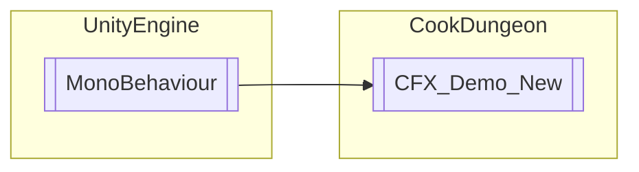

# CFX_Demo_New `Public class`

## Diagram


## Members
### Methods
#### Public  methods
| Returns | Name |
| --- | --- |
| `void` | [`OnNextEffect`](#onnexteffect)() |
| `void` | [`OnPreviousEffect`](#onpreviouseffect)() |
| `void` | [`OnToggleCamera`](#ontogglecamera)() |
| `void` | [`OnToggleGround`](#ontoggleground)() |
| `void` | [`OnToggleSlowMo`](#ontoggleslowmo)() |

## Details
### Inheritance
 - `MonoBehaviour`

### Constructors
#### CFX_Demo_New
```csharp
public CFX_Demo_New()
```

### Methods
#### OnToggleGround
```csharp
public void OnToggleGround()
```

#### OnToggleCamera
```csharp
public void OnToggleCamera()
```

#### OnToggleSlowMo
```csharp
public void OnToggleSlowMo()
```

#### OnPreviousEffect
```csharp
public void OnPreviousEffect()
```

#### OnNextEffect
```csharp
public void OnNextEffect()
```

*Generated with* [*ModularDoc*](https://github.com/hailstorm75/ModularDoc)
