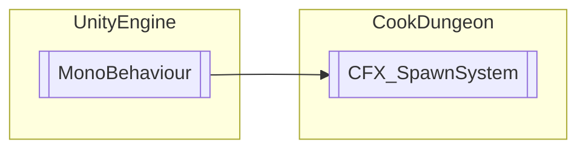

# CFX_SpawnSystem `Public class`

## Diagram


## Members
### Properties
#### Public Static properties
| Type | Name | Methods |
| --- | --- | --- |
| `bool` | [`AllObjectsLoaded`](#allobjectsloaded) | `get` |

### Methods
#### Public Static methods
| Returns | Name |
| --- | --- |
| `GameObject` | [`GetNextObject`](#getnextobject)(`GameObject` sourceObj, `bool` activateObject) |
| `void` | [`PreloadObject`](#preloadobject)(`GameObject` sourceObj, `int` poolSize) |
| `void` | [`UnloadObjects`](#unloadobjects)(`GameObject` sourceObj) |

## Details
### Inheritance
 - `MonoBehaviour`

### Constructors
#### CFX_SpawnSystem
```csharp
public CFX_SpawnSystem()
```

### Methods
#### GetNextObject
```csharp
public static GameObject GetNextObject(GameObject sourceObj, bool activateObject)
```
##### Arguments
| Type | Name | Description |
| --- | --- | --- |
| `GameObject` | sourceObj |   |
| `bool` | activateObject |   |

#### PreloadObject
```csharp
public static void PreloadObject(GameObject sourceObj, int poolSize)
```
##### Arguments
| Type | Name | Description |
| --- | --- | --- |
| `GameObject` | sourceObj |   |
| `int` | poolSize |   |

#### UnloadObjects
```csharp
public static void UnloadObjects(GameObject sourceObj)
```
##### Arguments
| Type | Name | Description |
| --- | --- | --- |
| `GameObject` | sourceObj |   |

### Properties
#### AllObjectsLoaded
```csharp
public static bool AllObjectsLoaded { get; }
```

*Generated with* [*ModularDoc*](https://github.com/hailstorm75/ModularDoc)
