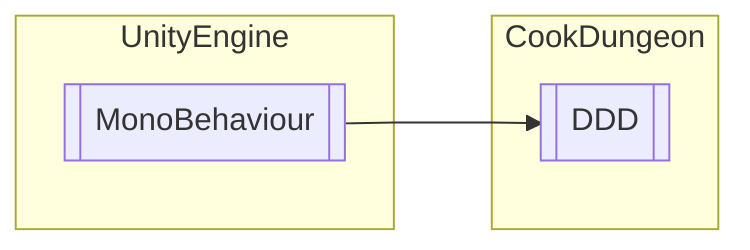

# DDD `Public class`

## Diagram


## Members
### Methods
#### Public  methods
| Returns | Name |
| --- | --- |
| `void` | [`B`](#b)() |
| `void` | [`D`](#d)() |

## Details
### Inheritance
 - `MonoBehaviour`

### Constructors
#### DDD
```csharp
public DDD()
```

### Methods
#### D
```csharp
public void D()
```

#### B
```csharp
public void B()
```

*Generated with* [*ModularDoc*](https://github.com/hailstorm75/ModularDoc)
