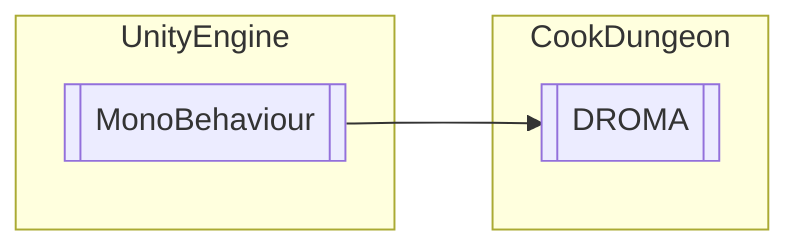

# DROMA `Public class`

## Diagram


## Members
### Methods
#### Public  methods
| Returns | Name |
| --- | --- |
| `void` | [`DNM`](#dnm)(`Transform` aper) |
| `void` | [`DropGoods`](#dropgoods)(`int` perk, `Transform` aper) |
| `void` | [`NM`](#nm)() |

## Details
### Inheritance
 - `MonoBehaviour`

### Constructors
#### DROMA
```csharp
public DROMA()
```

### Methods
#### DropGoods
```csharp
public void DropGoods(int perk, Transform aper)
```
##### Arguments
| Type | Name | Description |
| --- | --- | --- |
| `int` | perk |   |
| `Transform` | aper |   |

#### DNM
```csharp
public void DNM(Transform aper)
```
##### Arguments
| Type | Name | Description |
| --- | --- | --- |
| `Transform` | aper |   |

#### NM
```csharp
public void NM()
```

*Generated with* [*ModularDoc*](https://github.com/hailstorm75/ModularDoc)
