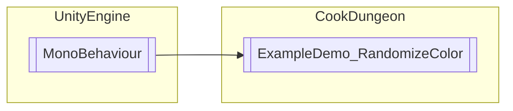

# ExampleDemo_RandomizeColor `Public class`

## Diagram


## Members
### Methods
#### Public  methods
| Returns | Name |
| --- | --- |
| `void` | [`RandomizeColor`](#randomizecolor)(`ColorVariable` target) |

## Details
### Inheritance
 - `MonoBehaviour`

### Constructors
#### ExampleDemo_RandomizeColor
```csharp
public ExampleDemo_RandomizeColor()
```

### Methods
#### RandomizeColor
```csharp
public void RandomizeColor(ColorVariable target)
```
##### Arguments
| Type | Name | Description |
| --- | --- | --- |
| `ColorVariable` | target |   |

*Generated with* [*ModularDoc*](https://github.com/hailstorm75/ModularDoc)
