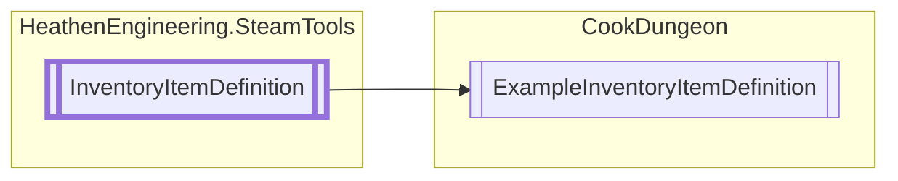

# ExampleInventoryItemDefinition `Public class`

## Diagram


## Details
### Inheritance
 - [
`InventoryItemDefinition`
](./heathenengineeringsteamtools-InventoryItemDefinition)

### Constructors
#### ExampleInventoryItemDefinition
```csharp
public ExampleInventoryItemDefinition()
```

*Generated with* [*ModularDoc*](https://github.com/hailstorm75/ModularDoc)
