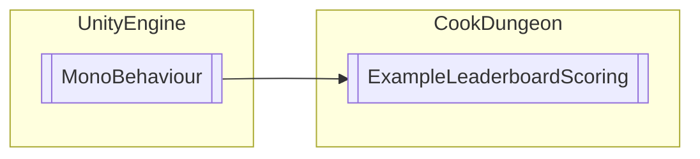

# ExampleLeaderboardScoring `Public class`

## Diagram


## Members
### Methods
#### Public  methods
| Returns | Name |
| --- | --- |
| `void` | [`AddToScore`](#addtoscore)(`int` score) |
| `void` | [`ForceUpdateScore`](#forceupdatescore)(`int` score) |
| `void` | [`GetHelp`](#gethelp)() |
| `void` | [`UnlockACH`](#unlockach)(`string` ACH) |
| `void` | [`UpdateScore`](#updatescore)(`int` score) |

## Details
### Inheritance
 - `MonoBehaviour`

### Constructors
#### ExampleLeaderboardScoring
```csharp
public ExampleLeaderboardScoring()
```

### Methods
#### UnlockACH
```csharp
public void UnlockACH(string ACH)
```
##### Arguments
| Type | Name | Description |
| --- | --- | --- |
| `string` | ACH |   |

#### UpdateScore
```csharp
public void UpdateScore(int score)
```
##### Arguments
| Type | Name | Description |
| --- | --- | --- |
| `int` | score |   |

#### ForceUpdateScore
```csharp
public void ForceUpdateScore(int score)
```
##### Arguments
| Type | Name | Description |
| --- | --- | --- |
| `int` | score |   |

#### AddToScore
```csharp
public void AddToScore(int score)
```
##### Arguments
| Type | Name | Description |
| --- | --- | --- |
| `int` | score |   |

#### GetHelp
```csharp
public void GetHelp()
```

*Generated with* [*ModularDoc*](https://github.com/hailstorm75/ModularDoc)
