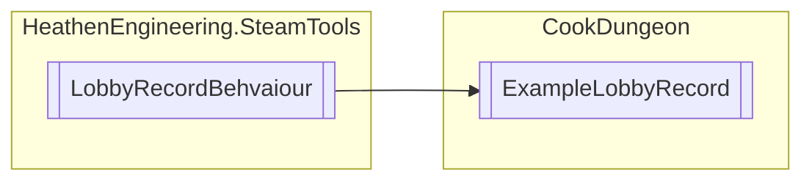

# ExampleLobbyRecord `Public class`

## Diagram


## Members
### Methods
#### Public  methods
| Returns | Name |
| --- | --- |
| `void` | [`Selected`](#selected)() |
| `void` | [`SetLobby`](#setlobby)(`LobbyHunterLobbyRecord` record, `HeathenSteamLobbySettings` lobbySettings) |

## Details
### Inheritance
 - `LobbyRecordBehvaiour`

### Constructors
#### ExampleLobbyRecord
```csharp
public ExampleLobbyRecord()
```

### Methods
#### SetLobby
```csharp
public override void SetLobby(LobbyHunterLobbyRecord record, HeathenSteamLobbySettings lobbySettings)
```
##### Arguments
| Type | Name | Description |
| --- | --- | --- |
| `LobbyHunterLobbyRecord` | record |   |
| `HeathenSteamLobbySettings` | lobbySettings |   |

#### Selected
```csharp
public void Selected()
```

*Generated with* [*ModularDoc*](https://github.com/hailstorm75/ModularDoc)
