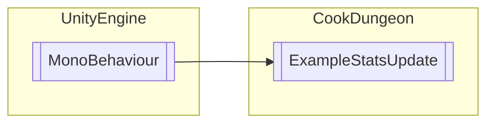

# ExampleStatsUpdate `Public class`

## Diagram


## Members
### Methods
#### Public  methods
| Returns | Name |
| --- | --- |
| `void` | [`GetHelp`](#gethelp)() |
| `void` | [`GetOverlayHelp`](#getoverlayhelp)() |
| `void` | [`OnRetrieveStatsAndAchievements`](#onretrievestatsandachievements)() |
| `void` | [`OnStoredStatsAndAchievements`](#onstoredstatsandachievements)() |
| `void` | [`UpdateStatValue`](#updatestatvalue)(`float` amount) |

## Details
### Inheritance
 - `MonoBehaviour`

### Constructors
#### ExampleStatsUpdate
```csharp
public ExampleStatsUpdate()
```

### Methods
#### UpdateStatValue
```csharp
public void UpdateStatValue(float amount)
```
##### Arguments
| Type | Name | Description |
| --- | --- | --- |
| `float` | amount |   |

#### GetHelp
```csharp
public void GetHelp()
```

#### GetOverlayHelp
```csharp
public void GetOverlayHelp()
```

#### OnRetrieveStatsAndAchievements
```csharp
public void OnRetrieveStatsAndAchievements()
```

#### OnStoredStatsAndAchievements
```csharp
public void OnStoredStatsAndAchievements()
```

*Generated with* [*ModularDoc*](https://github.com/hailstorm75/ModularDoc)
