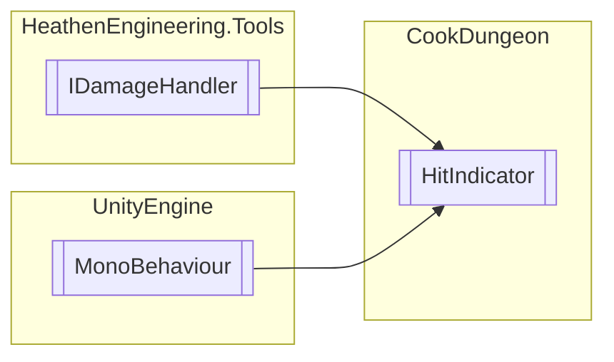

# HitIndicator `Public class`

## Diagram


## Members
### Methods
#### Public  methods
| Returns | Name |
| --- | --- |
| `void` | [`ApplyDamage`](#applydamage)(`Report` data) |
| `void` | [`Update`](#update)() |

## Details
### Inheritance
 - `IDamageHandler`&lt;`Report`&gt;
 - `MonoBehaviour`

### Constructors
#### HitIndicator
```csharp
public HitIndicator()
```

### Methods
#### Update
```csharp
public void Update()
```

#### ApplyDamage
```csharp
public virtual void ApplyDamage(Report data)
```
##### Arguments
| Type | Name | Description |
| --- | --- | --- |
| `Report` | data |   |

*Generated with* [*ModularDoc*](https://github.com/hailstorm75/ModularDoc)
