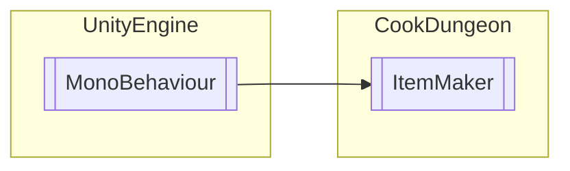

# ItemMaker `Public class`

## Diagram


## Members
### Methods
#### Public  methods
| Returns | Name |
| --- | --- |
| `void` | [`CCC`](#ccc)() |
| `void` | [`DOWNEffect`](#downeffect)(`int` INUM) |
| `void` | [`RIGHT`](#right)() |
| `void` | [`SETCB`](#setcb)(`Image` AMER) |
| `void` | [`SETCombine`](#setcombine)(`int` ItemSlotNum) |
| `void` | [`SETEB`](#seteb)(`Image` AMER) |
| `void` | [`SETSB`](#setsb)(`Image` AMER) |
| `void` | [`ScanCombine`](#scancombine)() |
| `void` | [`SetCookID`](#setcookid)(`int` a) |
| `void` | [`UPEffect`](#upeffect)(`int` INUM) |
| `void` | [`WRONG`](#wrong)() |
| `void` | [`akk`](#akk)() |
| `void` | [`tkk`](#tkk)() |

## Details
### Inheritance
 - `MonoBehaviour`

### Constructors
#### ItemMaker
```csharp
public ItemMaker()
```

### Methods
#### ScanCombine
```csharp
public void ScanCombine()
```

#### SETCombine
```csharp
public void SETCombine(int ItemSlotNum)
```
##### Arguments
| Type | Name | Description |
| --- | --- | --- |
| `int` | ItemSlotNum |   |

#### CCC
```csharp
public void CCC()
```

#### WRONG
```csharp
public void WRONG()
```

#### RIGHT
```csharp
public void RIGHT()
```

#### SetCookID
```csharp
public void SetCookID(int a)
```
##### Arguments
| Type | Name | Description |
| --- | --- | --- |
| `int` | a |   |

#### SETCB
```csharp
public void SETCB(Image AMER)
```
##### Arguments
| Type | Name | Description |
| --- | --- | --- |
| `Image` | AMER |   |

#### SETEB
```csharp
public void SETEB(Image AMER)
```
##### Arguments
| Type | Name | Description |
| --- | --- | --- |
| `Image` | AMER |   |

#### SETSB
```csharp
public void SETSB(Image AMER)
```
##### Arguments
| Type | Name | Description |
| --- | --- | --- |
| `Image` | AMER |   |

#### tkk
```csharp
public void tkk()
```

#### akk
```csharp
public void akk()
```

#### UPEffect
```csharp
public void UPEffect(int INUM)
```
##### Arguments
| Type | Name | Description |
| --- | --- | --- |
| `int` | INUM |   |

#### DOWNEffect
```csharp
public void DOWNEffect(int INUM)
```
##### Arguments
| Type | Name | Description |
| --- | --- | --- |
| `int` | INUM |   |

*Generated with* [*ModularDoc*](https://github.com/hailstorm75/ModularDoc)
