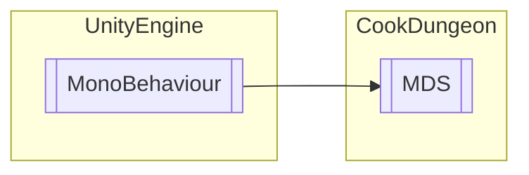

# MDS `Public class`

## Diagram


## Members
### Methods
#### Public  methods
| Returns | Name |
| --- | --- |
| `void` | [`SetDD1`](#setdd1)() |
| `void` | [`SetDD2`](#setdd2)() |
| `void` | [`SetDD3`](#setdd3)() |

## Details
### Inheritance
 - `MonoBehaviour`

### Constructors
#### MDS
```csharp
public MDS()
```

### Methods
#### SetDD1
```csharp
public void SetDD1()
```

#### SetDD2
```csharp
public void SetDD2()
```

#### SetDD3
```csharp
public void SetDD3()
```

*Generated with* [*ModularDoc*](https://github.com/hailstorm75/ModularDoc)
