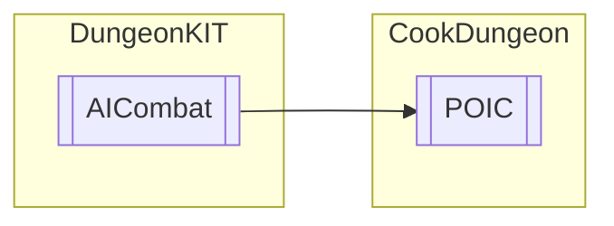

# POIC `Public class`

## Diagram


## Details
### Inheritance
 - [
`AICombat`
](./dungeonkit-AICombat)

### Constructors
#### POIC
```csharp
public POIC()
```

*Generated with* [*ModularDoc*](https://github.com/hailstorm75/ModularDoc)
