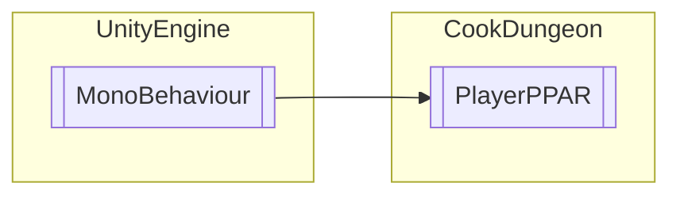

# PlayerPPAR `Public class`

## Diagram


## Members
### Methods
#### Public  methods
| Returns | Name |
| --- | --- |
| `void` | [`SetPPAR`](#setppar)(`int` k) |

## Details
### Inheritance
 - `MonoBehaviour`

### Constructors
#### PlayerPPAR
```csharp
public PlayerPPAR()
```

### Methods
#### SetPPAR
```csharp
public void SetPPAR(int k)
```
##### Arguments
| Type | Name | Description |
| --- | --- | --- |
| `int` | k |   |

*Generated with* [*ModularDoc*](https://github.com/hailstorm75/ModularDoc)
