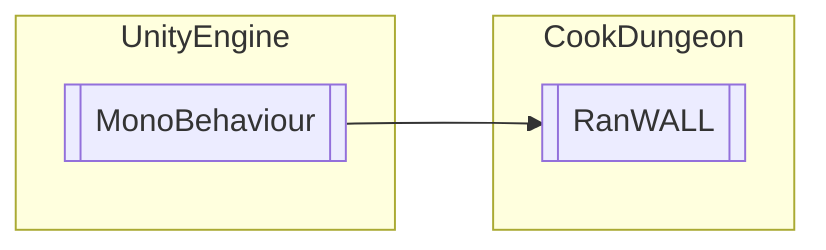

# RanWALL `Public class`

## Diagram


## Details
### Inheritance
 - `MonoBehaviour`

### Constructors
#### RanWALL
```csharp
public RanWALL()
```

*Generated with* [*ModularDoc*](https://github.com/hailstorm75/ModularDoc)
