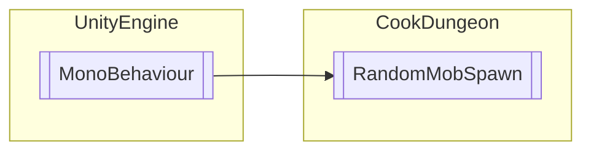

# RandomMobSpawn `Public class`

## Description
RandomSET3

## Diagram


## Members
### Methods
#### Public  methods
| Returns | Name |
| --- | --- |
| `void` | [`PP`](#pp)(`Transform` KKK) |

## Details
### Summary
RandomSET3

### Inheritance
 - `MonoBehaviour`

### Constructors
#### RandomMobSpawn
```csharp
public RandomMobSpawn()
```

### Methods
#### PP
```csharp
public void PP(Transform KKK)
```
##### Arguments
| Type | Name | Description |
| --- | --- | --- |
| `Transform` | KKK |   |

*Generated with* [*ModularDoc*](https://github.com/hailstorm75/ModularDoc)
