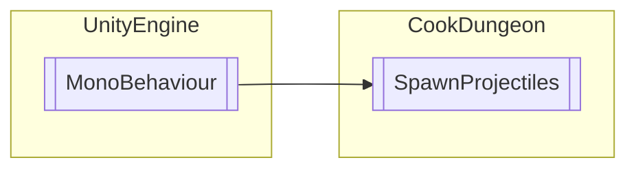

# SpawnProjectiles `Public class`

## Diagram


## Members
### Methods
#### Public  methods
| Returns | Name |
| --- | --- |
| `void` | [`Spawn`](#spawn)() |

## Details
### Inheritance
 - `MonoBehaviour`

### Constructors
#### SpawnProjectiles
```csharp
public SpawnProjectiles()
```

### Methods
#### Spawn
```csharp
public void Spawn()
```

*Generated with* [*ModularDoc*](https://github.com/hailstorm75/ModularDoc)
