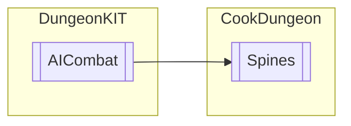

# Spines `Public class`

## Diagram


## Members
### Methods
#### Public  methods
| Returns | Name |
| --- | --- |
| `void` | [`FixSHurt`](#fixshurt)() |
| `void` | [`SetCanHurt`](#setcanhurt)() |
| `void` | [`SetNoHurt`](#setnohurt)() |

## Details
### Inheritance
 - [
`AICombat`
](./dungeonkit-AICombat)

### Constructors
#### Spines
```csharp
public Spines()
```

### Methods
#### SetCanHurt
```csharp
public void SetCanHurt()
```

#### SetNoHurt
```csharp
public void SetNoHurt()
```

#### FixSHurt
```csharp
public void FixSHurt()
```

*Generated with* [*ModularDoc*](https://github.com/hailstorm75/ModularDoc)
