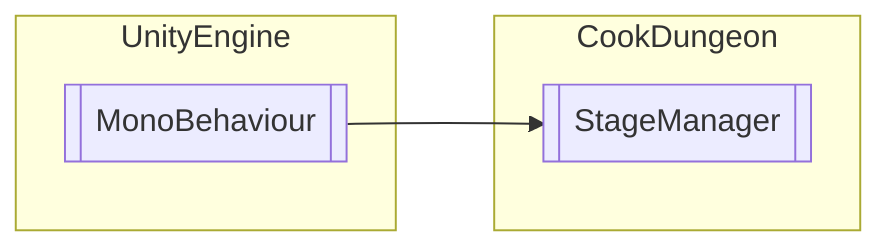

# StageManager `Public class`

## Description
SGManager

## Diagram


## Members
### Methods
#### Public  methods
| Returns | Name |
| --- | --- |
| `void` | [`INLEVEL`](#inlevel)(`Transform` pp, `int` DoorDIR) |

## Details
### Summary
SGManager

### Inheritance
 - `MonoBehaviour`

### Constructors
#### StageManager
```csharp
public StageManager()
```

### Methods
#### INLEVEL
```csharp
public void INLEVEL(Transform pp, int DoorDIR)
```
##### Arguments
| Type | Name | Description |
| --- | --- | --- |
| `Transform` | pp |   |
| `int` | DoorDIR |   |

*Generated with* [*ModularDoc*](https://github.com/hailstorm75/ModularDoc)
