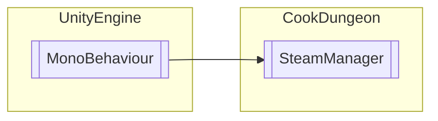

# SteamManager `Public class`

## Diagram


## Members
### Properties
#### Protected Static properties
| Type | Name | Methods |
| --- | --- | --- |
| [`SteamManager`](cookdungeon-SteamManager) | [`Instance`](#instance) | `get` |

#### Public Static properties
| Type | Name | Methods |
| --- | --- | --- |
| `bool` | [`Initialized`](#initialized) | `get` |

### Methods
#### Protected Static methods
| Returns | Name |
| --- | --- |
| `void` | [`SteamAPIDebugTextHook`](#steamapidebugtexthook)(`int` nSeverity, `StringBuilder` pchDebugText) |

#### Protected  methods
| Returns | Name |
| --- | --- |
| `void` | [`Awake`](#awake)() |
| `void` | [`OnDestroy`](#ondestroy)() |
| `void` | [`OnEnable`](#onenable)() |
| `void` | [`Update`](#update)() |

## Details
### Inheritance
 - `MonoBehaviour`

### Constructors
#### SteamManager
```csharp
public SteamManager()
```

### Methods
#### SteamAPIDebugTextHook
```csharp
protected static void SteamAPIDebugTextHook(int nSeverity, StringBuilder pchDebugText)
```
##### Arguments
| Type | Name | Description |
| --- | --- | --- |
| `int` | nSeverity |   |
| `StringBuilder` | pchDebugText |   |

#### Awake
```csharp
protected virtual void Awake()
```

#### OnEnable
```csharp
protected virtual void OnEnable()
```

#### OnDestroy
```csharp
protected virtual void OnDestroy()
```

#### Update
```csharp
protected virtual void Update()
```

### Properties
#### Instance
```csharp
protected static SteamManager Instance { get; }
```

#### Initialized
```csharp
public static bool Initialized { get; }
```

*Generated with* [*ModularDoc*](https://github.com/hailstorm75/ModularDoc)
