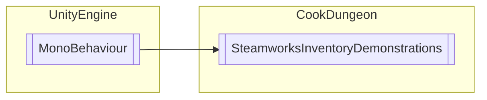

# SteamworksInventoryDemonstrations `Public class`

## Diagram


## Members
### Methods
#### Public  methods
| Returns | Name |
| --- | --- |
| `void` | [`getAllTest`](#getalltest)() |
| `void` | [`grantPromoTest`](#grantpromotest)() |

## Details
### Inheritance
 - `MonoBehaviour`

### Constructors
#### SteamworksInventoryDemonstrations
```csharp
public SteamworksInventoryDemonstrations()
```

### Methods
#### getAllTest
```csharp
public void getAllTest()
```

#### grantPromoTest
```csharp
public void grantPromoTest()
```

*Generated with* [*ModularDoc*](https://github.com/hailstorm75/ModularDoc)
