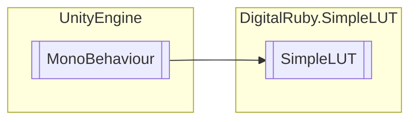

# SimpleLUT `Public class`

## Diagram


## Members
### Methods
#### Public  methods
| Returns | Name |
| --- | --- |
| `void` | [`SetIdentityLut`](#setidentitylut)() |
| `bool` | [`ValidDimensions`](#validdimensions)(`Texture2D` tex2d) |

#### Internal  methods
| Returns | Name |
| --- | --- |
| `bool` | [`Convert`](#convert)(`Texture2D` lookupTexture) |

## Details
### Inheritance
 - `MonoBehaviour`

### Constructors
#### SimpleLUT
```csharp
public SimpleLUT()
```

### Methods
#### SetIdentityLut
```csharp
public void SetIdentityLut()
```

#### ValidDimensions
```csharp
public bool ValidDimensions(Texture2D tex2d)
```
##### Arguments
| Type | Name | Description |
| --- | --- | --- |
| `Texture2D` | tex2d |   |

#### Convert
```csharp
internal bool Convert(Texture2D lookupTexture)
```
##### Arguments
| Type | Name | Description |
| --- | --- | --- |
| `Texture2D` | lookupTexture |   |

*Generated with* [*ModularDoc*](https://github.com/hailstorm75/ModularDoc)
