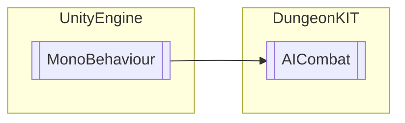

# AICombat `Public class`

## Diagram


## Members
### Methods
#### Public  methods
| Returns | Name |
| --- | --- |
| `void` | [`MeleeAttack`](#meleeattack)(`GameObject` target) |
| `void` | [`RangeAttack`](#rangeattack)(`GameObject` rangeWeapon, `Transform` target) |

## Details
### Inheritance
 - `MonoBehaviour`

### Constructors
#### AICombat
```csharp
public AICombat()
```

### Methods
#### RangeAttack
```csharp
public virtual void RangeAttack(GameObject rangeWeapon, Transform target)
```
##### Arguments
| Type | Name | Description |
| --- | --- | --- |
| `GameObject` | rangeWeapon |   |
| `Transform` | target |   |

#### MeleeAttack
```csharp
public virtual void MeleeAttack(GameObject target)
```
##### Arguments
| Type | Name | Description |
| --- | --- | --- |
| `GameObject` | target |   |

*Generated with* [*ModularDoc*](https://github.com/hailstorm75/ModularDoc)
