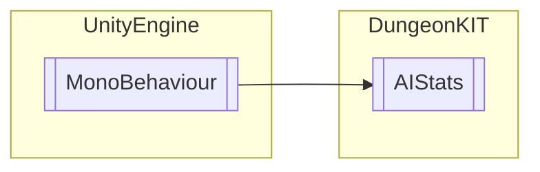

# AIStats `Public class`

## Diagram


## Members
### Methods
#### Public  methods
| Returns | Name |
| --- | --- |
| `void` | [`SuckHP`](#suckhp)(`float` SuckBloodHP) |
| `void` | [`TakingDamage`](#takingdamage)(`float` damage) |

## Details
### Inheritance
 - `MonoBehaviour`

### Constructors
#### AIStats
```csharp
public AIStats()
```

### Methods
#### TakingDamage
```csharp
public void TakingDamage(float damage)
```
##### Arguments
| Type | Name | Description |
| --- | --- | --- |
| `float` | damage |   |

#### SuckHP
```csharp
public void SuckHP(float SuckBloodHP)
```
##### Arguments
| Type | Name | Description |
| --- | --- | --- |
| `float` | SuckBloodHP |   |

### Events
#### onDeath
```csharp
public event DeathAction onDeath
```

### Delegates
#### DeathAction
```csharp
public delegate void DeathAction()
```

*Generated with* [*ModularDoc*](https://github.com/hailstorm75/ModularDoc)
