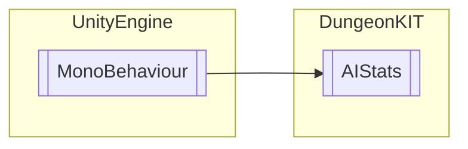

# AIStats `Public class`

## Diagram


## Members
### Methods
#### Public  methods
| Returns | Name |
| --- | --- |
| `void` | [`Death`](#death)()<br>This method handles death for all AI's<br>            The method does a few things to verify what died so that it can preform proper actions for each mob types death<br>            <br>            It first checks to see if the onDeath variable has an event tied to it. If it does it starts off the death with that event<br>            It then goes to the drop manager and starts the DropGoods method which is the actual part the spawns the item. It passes its location and the perk variable.<br>            It then checks to see if the enemy was a boss. If it was rthen It also runs the DNM method from the drop manager<br>            It then checks to see if it was a big enemy if it was it chages the Stage Managers BigEnemyAlive variable to false. This is due to the fact that a boss cant spawn if a big enemy is alive or pending <br>            Finally it destroys itself |
| `void` | [`SuckHP`](#suckhp)(`float` SuckBloodHP) |
| `void` | [`TakingDamage`](#takingdamage)(`float` damage) |

## Details
### Inheritance
 - `MonoBehaviour`

### Constructors
#### AIStats
```csharp
public AIStats()
```

### Methods
#### TakingDamage
```csharp
public void TakingDamage(float damage)
```
##### Arguments
| Type | Name | Description |
| --- | --- | --- |
| `float` | damage |   |

#### SuckHP
```csharp
public void SuckHP(float SuckBloodHP)
```
##### Arguments
| Type | Name | Description |
| --- | --- | --- |
| `float` | SuckBloodHP |   |

#### Death
```csharp
public void Death()
```
##### Summary
This method handles death for all AI's
            The method does a few things to verify what died so that it can preform proper actions for each mob types death
            
            It first checks to see if the onDeath variable has an event tied to it. If it does it starts off the death with that event
            It then goes to the drop manager and starts the DropGoods method which is the actual part the spawns the item. It passes its location and the perk variable.
            It then checks to see if the enemy was a boss. If it was rthen It also runs the DNM method from the drop manager
            It then checks to see if it was a big enemy if it was it chages the Stage Managers BigEnemyAlive variable to false. This is due to the fact that a boss cant spawn if a big enemy is alive or pending 
            Finally it destroys itself

### Events
#### onDeath
```csharp
public event DeathAction onDeath
```

### Delegates
#### DeathAction
```csharp
public delegate void DeathAction()
```

*Generated with* [*ModularDoc*](https://github.com/hailstorm75/ModularDoc)
