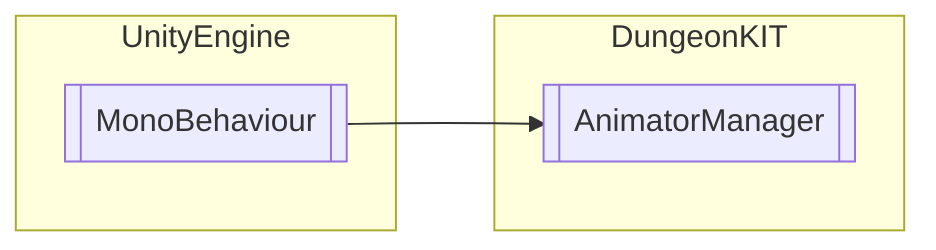

# AnimatorManager `Public class`

## Diagram


## Members
### Methods
#### Public  methods
| Returns | Name |
| --- | --- |
| `void` | [`PlayAnimation`](#playanimation)(`string` animationName) |
| `void` | [`PlayPlayableDirector`](#playplayabledirector)(`TimelineAsset` timelineAsset, `DirectorWrapMode` directorWrap) |

## Details
### Inheritance
 - `MonoBehaviour`

### Constructors
#### AnimatorManager
```csharp
public AnimatorManager()
```

### Methods
#### PlayAnimation
```csharp
public void PlayAnimation(string animationName)
```
##### Arguments
| Type | Name | Description |
| --- | --- | --- |
| `string` | animationName |   |

#### PlayPlayableDirector
```csharp
public void PlayPlayableDirector(TimelineAsset timelineAsset, DirectorWrapMode directorWrap)
```
##### Arguments
| Type | Name | Description |
| --- | --- | --- |
| `TimelineAsset` | timelineAsset |   |
| `DirectorWrapMode` | directorWrap |   |

*Generated with* [*ModularDoc*](https://github.com/hailstorm75/ModularDoc)
