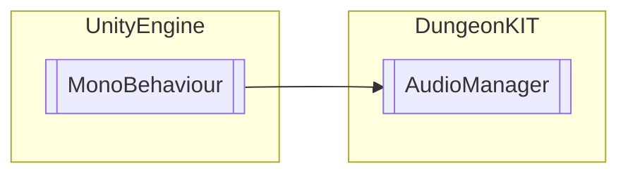

# AudioManager `Public class`

## Diagram


## Members
### Methods
#### Public  methods
| Returns | Name |
| --- | --- |
| `void` | [`Play`](#play)(`AudioSource` audioSource, `AudioClip` audioClip, `bool` loop) |
| `void` | [`PlayMusic`](#playmusic)(`AudioClip` music) |

## Details
### Inheritance
 - `MonoBehaviour`

### Constructors
#### AudioManager
```csharp
public AudioManager()
```

### Methods
#### PlayMusic
```csharp
public void PlayMusic(AudioClip music)
```
##### Arguments
| Type | Name | Description |
| --- | --- | --- |
| `AudioClip` | music |   |

#### Play
```csharp
public void Play(AudioSource audioSource, AudioClip audioClip, bool loop)
```
##### Arguments
| Type | Name | Description |
| --- | --- | --- |
| `AudioSource` | audioSource |   |
| `AudioClip` | audioClip |   |
| `bool` | loop |   |

*Generated with* [*ModularDoc*](https://github.com/hailstorm75/ModularDoc)
