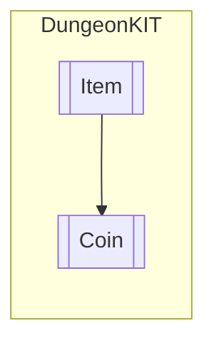

# Coin `Public class`

## Diagram


## Members
### Methods
#### Public  methods
| Returns | Name |
| --- | --- |
| `void` | [`OnPickedUp`](#onpickedup)() |
| `void` | [`OnTriggerEnter2D`](#ontriggerenter2d)(`Collider2D` collision) |

## Details
### Inheritance
 - [
`Item`
](./dungeonkit-Item)

### Constructors
#### Coin
```csharp
public Coin()
```

### Methods
#### OnPickedUp
```csharp
public void OnPickedUp()
```

#### OnTriggerEnter2D
```csharp
public override void OnTriggerEnter2D(Collider2D collision)
```
##### Arguments
| Type | Name | Description |
| --- | --- | --- |
| `Collider2D` | collision |   |

*Generated with* [*ModularDoc*](https://github.com/hailstorm75/ModularDoc)
