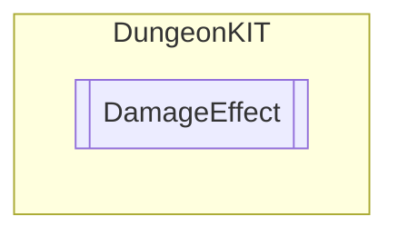

# DamageEffect `Public class`

## Diagram


## Members
### Methods
#### Public  methods
| Returns | Name |
| --- | --- |
| `IEnumerator` | [`Damage`](#damage)(`SpriteRenderer` sprite) |

## Details
### Constructors
#### DamageEffect
```csharp
public DamageEffect()
```

### Methods
#### Damage
```csharp
public IEnumerator Damage(SpriteRenderer sprite)
```
##### Arguments
| Type | Name | Description |
| --- | --- | --- |
| `SpriteRenderer` | sprite |   |

*Generated with* [*ModularDoc*](https://github.com/hailstorm75/ModularDoc)
