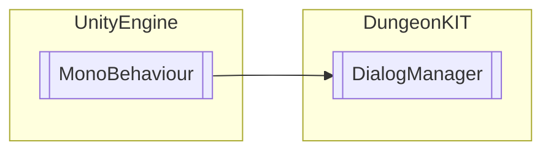

# DialogManager `Public class`

## Diagram


## Members
### Methods
#### Public  methods
| Returns | Name |
| --- | --- |
| `void` | [`SetDialogConfig`](#setdialogconfig)([`DialogConfig`](./dungeonkit-DialogConfig) dialogConfig) |
| `void` | [`SetDialogState`](#setdialogstate)([`DialogConfig`](./dungeonkit-DialogConfig) dialogConfig, `int` state) |

## Details
### Inheritance
 - `MonoBehaviour`

### Constructors
#### DialogManager
```csharp
public DialogManager()
```

### Methods
#### SetDialogConfig
```csharp
public void SetDialogConfig(DialogConfig dialogConfig)
```
##### Arguments
| Type | Name | Description |
| --- | --- | --- |
| [`DialogConfig`](./dungeonkit-DialogConfig) | dialogConfig |   |

#### SetDialogState
```csharp
public void SetDialogState(DialogConfig dialogConfig, int state)
```
##### Arguments
| Type | Name | Description |
| --- | --- | --- |
| [`DialogConfig`](./dungeonkit-DialogConfig) | dialogConfig |   |
| `int` | state |   |

*Generated with* [*ModularDoc*](https://github.com/hailstorm75/ModularDoc)
