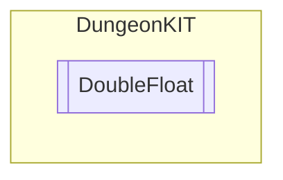

# DoubleFloat `Public class`

## Diagram


## Members
### Methods
#### Public  methods
| Returns | Name |
| --- | --- |
| `float` | [`RandomFloat`](#randomfloat)() |

## Details
### Constructors
#### DoubleFloat
```csharp
public DoubleFloat(float currentFloat, float maxFloat)
```
##### Arguments
| Type | Name | Description |
| --- | --- | --- |
| `float` | currentFloat |   |
| `float` | maxFloat |   |

### Methods
#### RandomFloat
```csharp
public float RandomFloat()
```

*Generated with* [*ModularDoc*](https://github.com/hailstorm75/ModularDoc)
