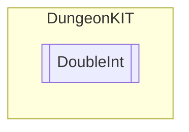

# DoubleInt `Public class`

## Diagram


## Details
### Constructors
#### DoubleInt
```csharp
public DoubleInt(int currentInt, int maxInt)
```
##### Arguments
| Type | Name | Description |
| --- | --- | --- |
| `int` | currentInt |   |
| `int` | maxInt |   |

*Generated with* [*ModularDoc*](https://github.com/hailstorm75/ModularDoc)
