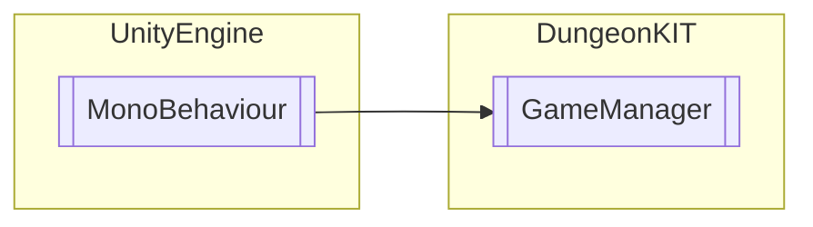

# GameManager `Public class`

## Diagram


## Members
### Methods
#### Public  methods
| Returns | Name |
| --- | --- |
| `void` | [`GameOver`](#gameover)() |
| `void` | [`LevelComplete`](#levelcomplete)() |

## Details
### Inheritance
 - `MonoBehaviour`

### Constructors
#### GameManager
```csharp
public GameManager()
```

### Methods
#### GameOver
```csharp
public void GameOver()
```

#### LevelComplete
```csharp
public void LevelComplete()
```

*Generated with* [*ModularDoc*](https://github.com/hailstorm75/ModularDoc)
