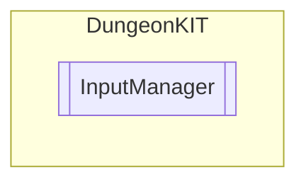

# InputManager `Public class`

## Diagram


## Members
### Properties
#### Public Static properties
| Type | Name | Methods |
| --- | --- | --- |
| `bool` | [`Attack`](#attack) | `get` |
| `bool` | [`Health`](#health) | `get, set` |
| `float` | [`Horizontal`](#horizontal) | `get` |
| `bool` | [`Interaction`](#interaction) | `get, set` |
| `Vector3` | [`MousePosition`](#mouseposition) | `get` |
| `float` | [`MouseXPositon`](#mousexpositon) | `get` |
| `bool` | [`Pause`](#pause) | `get, set` |
| `float` | [`Vertical`](#vertical) | `get` |

## Details
### Constructors
#### InputManager
```csharp
public InputManager()
```

### Properties
#### Vertical
```csharp
public static float Vertical { get; }
```

#### Horizontal
```csharp
public static float Horizontal { get; }
```

#### MousePosition
```csharp
public static Vector3 MousePosition { get; }
```

#### MouseXPositon
```csharp
public static float MouseXPositon { get; }
```

#### Attack
```csharp
public static bool Attack { get; }
```

#### Interaction
```csharp
public static bool Interaction { get; set; }
```

#### Pause
```csharp
public static bool Pause { get; set; }
```

#### Health
```csharp
public static bool Health { get; set; }
```

*Generated with* [*ModularDoc*](https://github.com/hailstorm75/ModularDoc)
