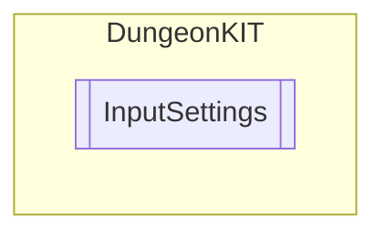

# InputSettings `Public class`

## Diagram


## Members
### Properties
#### Public Static properties
| Type | Name | Methods |
| --- | --- | --- |
| `string` | [`AttackKey`](#attackkey) | `get` |
| `KeyCode` | [`HealthKey`](#healthkey) | `get` |
| `KeyCode` | [`InteractionKey`](#interactionkey) | `get` |
| `KeyCode` | [`PauseKey`](#pausekey) | `get` |

## Details
### Constructors
#### InputSettings
```csharp
public InputSettings()
```

### Properties
#### InteractionKey
```csharp
public static KeyCode InteractionKey { get; }
```

#### AttackKey
```csharp
public static string AttackKey { get; }
```

#### PauseKey
```csharp
public static KeyCode PauseKey { get; }
```

#### HealthKey
```csharp
public static KeyCode HealthKey { get; }
```

*Generated with* [*ModularDoc*](https://github.com/hailstorm75/ModularDoc)
