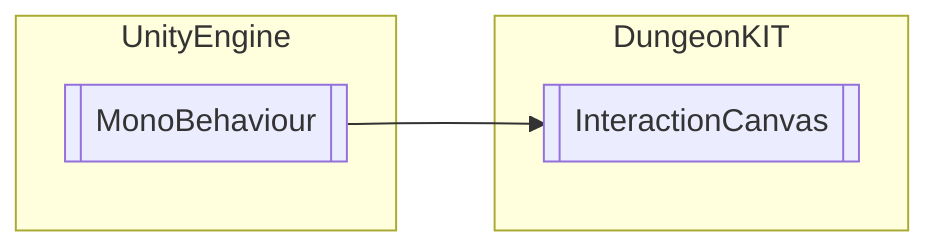

# InteractionCanvas `Public class`

## Diagram


## Members
### Properties
#### Public  properties
| Type | Name | Methods |
| --- | --- | --- |
| `string` | [`interaction`](#interaction) | `get` |

## Details
### Inheritance
 - `MonoBehaviour`

### Constructors
#### InteractionCanvas
```csharp
public InteractionCanvas()
```

### Properties
#### interaction
```csharp
public string interaction { get; }
```

*Generated with* [*ModularDoc*](https://github.com/hailstorm75/ModularDoc)
