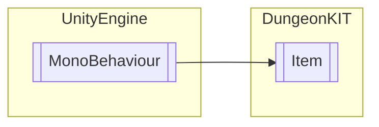

# Item `Public class`

## Diagram


## Members
### Methods
#### Public  methods
| Returns | Name |
| --- | --- |
| `void` | [`OnTriggerEnter2D`](#ontriggerenter2d)(`Collider2D` collision) |

## Details
### Inheritance
 - `MonoBehaviour`

### Constructors
#### Item
```csharp
public Item()
```

### Methods
#### OnTriggerEnter2D
```csharp
public virtual void OnTriggerEnter2D(Collider2D collision)
```
##### Arguments
| Type | Name | Description |
| --- | --- | --- |
| `Collider2D` | collision |   |

### Events
#### onPickedUp
```csharp
public event PickedUpAction onPickedUp
```

### Delegates
#### PickedUpAction
```csharp
public delegate void PickedUpAction()
```

*Generated with* [*ModularDoc*](https://github.com/hailstorm75/ModularDoc)
