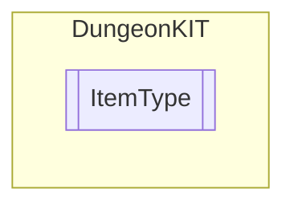

# ItemType `Public enum`

## Diagram

```mermaid
  flowchart LR
  classDef interfaceStyle stroke-dasharray: 5 5;
  classDef abstractStyle stroke-width:4px
  subgraph DungeonKIT
  DungeonKIT.ItemType[[ItemType]]
  end
```

## Details
### Fields
#### Item

#### Key

#### Coin

#### Equip

*Generated with* [*ModularDoc*](https://github.com/hailstorm75/ModularDoc)
