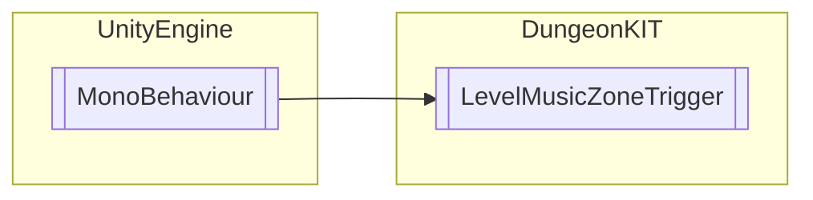

# LevelMusicZoneTrigger `Public class`

## Diagram


## Members
### Methods
#### Public  methods
| Returns | Name |
| --- | --- |
| `void` | [`OnTriggerEnter2D`](#ontriggerenter2d)(`Collider2D` collision) |
| `void` | [`OnTriggerExit2D`](#ontriggerexit2d)(`Collider2D` collision) |

## Details
### Inheritance
 - `MonoBehaviour`

### Constructors
#### LevelMusicZoneTrigger
```csharp
public LevelMusicZoneTrigger()
```

### Methods
#### OnTriggerEnter2D
```csharp
public void OnTriggerEnter2D(Collider2D collision)
```
##### Arguments
| Type | Name | Description |
| --- | --- | --- |
| `Collider2D` | collision |   |

#### OnTriggerExit2D
```csharp
public void OnTriggerExit2D(Collider2D collision)
```
##### Arguments
| Type | Name | Description |
| --- | --- | --- |
| `Collider2D` | collision |   |

*Generated with* [*ModularDoc*](https://github.com/hailstorm75/ModularDoc)
