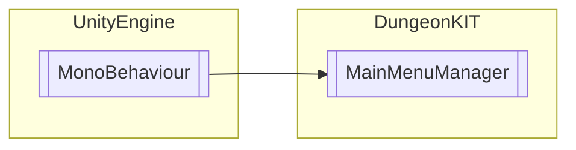

# MainMenuManager `Public class`

## Diagram


## Members
### Methods
#### Public  methods
| Returns | Name |
| --- | --- |
| `void` | [`LoadGame`](#loadgame)() |
| `void` | [`NewGame`](#newgame)() |
| `void` | [`Quit`](#quit)() |
| `void` | [`SplashScreenClose`](#splashscreenclose)() |

## Details
### Inheritance
 - `MonoBehaviour`

### Constructors
#### MainMenuManager
```csharp
public MainMenuManager()
```

### Methods
#### SplashScreenClose
```csharp
public void SplashScreenClose()
```

#### NewGame
```csharp
public void NewGame()
```

#### LoadGame
```csharp
public void LoadGame()
```

#### Quit
```csharp
public void Quit()
```

*Generated with* [*ModularDoc*](https://github.com/hailstorm75/ModularDoc)
