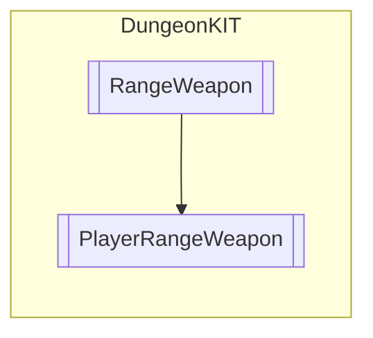

# PlayerRangeWeapon `Public class`

## Diagram


## Members
### Methods
#### Public  methods
| Returns | Name |
| --- | --- |
| `void` | [`OnTriggerEnter2D`](#ontriggerenter2d)(`Collider2D` collider) |

## Details
### Inheritance
 - [
`RangeWeapon`
](./dungeonkit-RangeWeapon)

### Constructors
#### PlayerRangeWeapon
```csharp
public PlayerRangeWeapon()
```

### Methods
#### OnTriggerEnter2D
```csharp
public override void OnTriggerEnter2D(Collider2D collider)
```
##### Arguments
| Type | Name | Description |
| --- | --- | --- |
| `Collider2D` | collider |   |

*Generated with* [*ModularDoc*](https://github.com/hailstorm75/ModularDoc)
