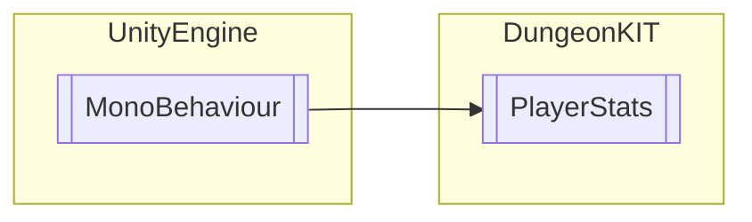

# PlayerStats `Public class`

## Diagram


## Members
### Methods
#### Public  methods
| Returns | Name |
| --- | --- |
| `void` | [`GETMONEY`](#getmoney-12)(`...`) |
| `void` | [`Healing`](#healing)(`int` a) |
| `void` | [`Health`](#health)() |
| `void` | [`REGame`](#regame)() |
| `void` | [`TakingDamage`](#takingdamage-13)(`...`) |

## Details
### Inheritance
 - `MonoBehaviour`

### Constructors
#### PlayerStats
```csharp
public PlayerStats()
```

### Methods
#### REGame
```csharp
public void REGame()
```

#### Healing
```csharp
public void Healing(int a)
```
##### Arguments
| Type | Name | Description |
| --- | --- | --- |
| `int` | a |   |

#### TakingDamage [1/3]
```csharp
public void TakingDamage()
```

#### TakingDamage [2/3]
```csharp
public void TakingDamage(int atkRange)
```
##### Arguments
| Type | Name | Description |
| --- | --- | --- |
| `int` | atkRange |   |

#### TakingDamage [3/3]
```csharp
public void TakingDamage(int atkRange, int mix1d)
```
##### Arguments
| Type | Name | Description |
| --- | --- | --- |
| `int` | atkRange |   |
| `int` | mix1d |   |

#### GETMONEY [1/2]
```csharp
public void GETMONEY()
```

#### GETMONEY [2/2]
```csharp
public void GETMONEY(int a)
```
##### Arguments
| Type | Name | Description |
| --- | --- | --- |
| `int` | a |   |

#### Health
```csharp
public void Health()
```

*Generated with* [*ModularDoc*](https://github.com/hailstorm75/ModularDoc)
