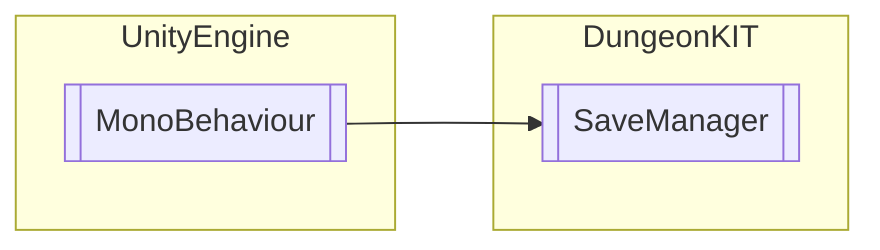

# SaveManager `Public class`

## Diagram


## Members
### Methods
#### Public Static methods
| Returns | Name |
| --- | --- |
| `void` | [`Load`](#load)() |
| `void` | [`Save`](#save)() |

## Details
### Inheritance
 - `MonoBehaviour`

### Constructors
#### SaveManager
```csharp
public SaveManager()
```

### Methods
#### Save
```csharp
public static void Save()
```

#### Load
```csharp
public static void Load()
```

*Generated with* [*ModularDoc*](https://github.com/hailstorm75/ModularDoc)
