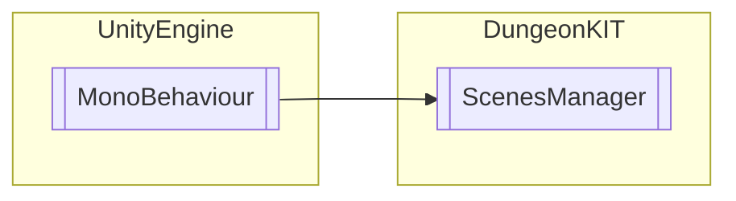

# ScenesManager `Public class`

## Diagram


## Members
### Methods
#### Public  methods
| Returns | Name |
| --- | --- |
| `void` | [`LoadAdditiveScene`](#loadadditivescene)(`string` sceneName) |
| `void` | [`LoadLoadingScene`](#loadloadingscene)(`string` sceneToLoad) |

## Details
### Inheritance
 - `MonoBehaviour`

### Constructors
#### ScenesManager
```csharp
public ScenesManager()
```

### Methods
#### LoadLoadingScene
```csharp
public void LoadLoadingScene(string sceneToLoad)
```
##### Arguments
| Type | Name | Description |
| --- | --- | --- |
| `string` | sceneToLoad |   |

#### LoadAdditiveScene
```csharp
public void LoadAdditiveScene(string sceneName)
```
##### Arguments
| Type | Name | Description |
| --- | --- | --- |
| `string` | sceneName |   |

*Generated with* [*ModularDoc*](https://github.com/hailstorm75/ModularDoc)
