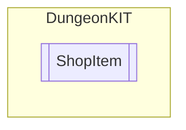

# ShopItem `Public class`

## Diagram


## Details
### Nested types
#### Enums
 - `ItemType`

### Constructors
#### ShopItem
```csharp
public ShopItem()
```

*Generated with* [*ModularDoc*](https://github.com/hailstorm75/ModularDoc)
