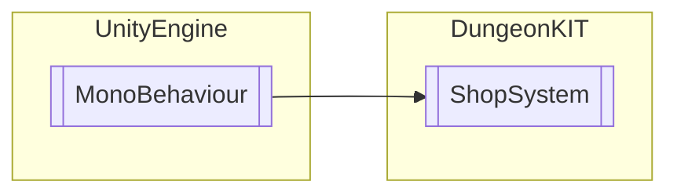

# ShopSystem `Public class`

## Diagram


## Members
### Methods
#### Public  methods
| Returns | Name |
| --- | --- |
| `void` | [`Buy`](#buy)(`int` itemID) |
| `void` | [`OnEnable`](#onenable)() |
| `void` | [`READDONE`](#readdone)() |
| `void` | [`SetCLOSE`](#setclose)() |

## Details
### Inheritance
 - `MonoBehaviour`

### Constructors
#### ShopSystem
```csharp
public ShopSystem()
```

### Methods
#### OnEnable
```csharp
public void OnEnable()
```

#### SetCLOSE
```csharp
public void SetCLOSE()
```

#### Buy
```csharp
public void Buy(int itemID)
```
##### Arguments
| Type | Name | Description |
| --- | --- | --- |
| `int` | itemID |   |

#### READDONE
```csharp
public void READDONE()
```

*Generated with* [*ModularDoc*](https://github.com/hailstorm75/ModularDoc)
