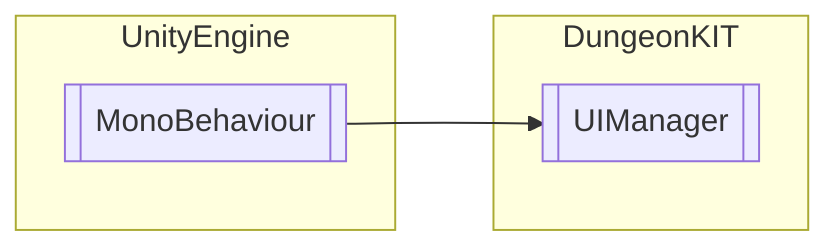

# UIManager `Public class`

## Diagram


## Members
### Methods
#### Public  methods
| Returns | Name |
| --- | --- |
| `void` | [`CloseDialogMenu`](#closedialogmenu)() |
| `void` | [`CloseShopMenu`](#closeshopmenu)(`object` sender, `EventArgs` e) |
| `void` | [`GameEnd`](#gameend)() |
| `void` | [`GameOver`](#gameover)() |
| `void` | [`LoadMainMenu`](#loadmainmenu)() |
| `void` | [`Pause`](#pause)() |
| `void` | [`ShowDialogMenu`](#showdialogmenu)([`DialogConfig`](./dungeonkit-DialogConfig) dialogConfig) |
| `void` | [`ShowShopMenu`](#showshopmenu)() |
| `void` | [`UpdateHP`](#updatehp)() |
| `void` | [`UpdateUI`](#updateui)() |

## Details
### Inheritance
 - `MonoBehaviour`

### Constructors
#### UIManager
```csharp
public UIManager()
```

### Methods
#### UpdateUI
```csharp
public void UpdateUI()
```

#### UpdateHP
```csharp
public void UpdateHP()
```

#### ShowDialogMenu
```csharp
public void ShowDialogMenu(DialogConfig dialogConfig)
```
##### Arguments
| Type | Name | Description |
| --- | --- | --- |
| [`DialogConfig`](./dungeonkit-DialogConfig) | dialogConfig |   |

#### ShowShopMenu
```csharp
public void ShowShopMenu()
```

#### CloseDialogMenu
```csharp
public void CloseDialogMenu()
```

#### CloseShopMenu
```csharp
public void CloseShopMenu(object sender, EventArgs e)
```
##### Arguments
| Type | Name | Description |
| --- | --- | --- |
| `object` | sender |   |
| `EventArgs` | e |   |

#### Pause
```csharp
public void Pause()
```

#### GameOver
```csharp
public void GameOver()
```

#### GameEnd
```csharp
public void GameEnd()
```

#### LoadMainMenu
```csharp
public void LoadMainMenu()
```

### Events
#### dialogClosed
```csharp
public event EventHandler dialogClosed
```

*Generated with* [*ModularDoc*](https://github.com/hailstorm75/ModularDoc)
