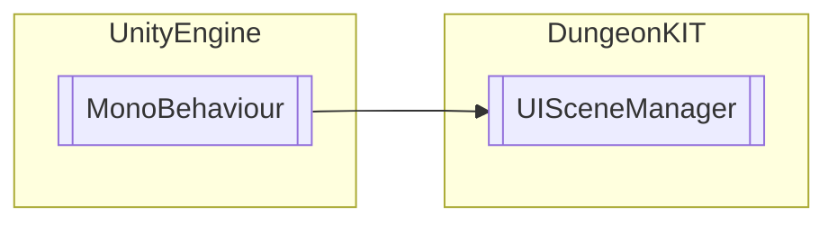

# UISceneManager `Public class`

## Diagram


## Details
### Inheritance
 - `MonoBehaviour`

### Constructors
#### UISceneManager
```csharp
public UISceneManager()
```

*Generated with* [*ModularDoc*](https://github.com/hailstorm75/ModularDoc)
